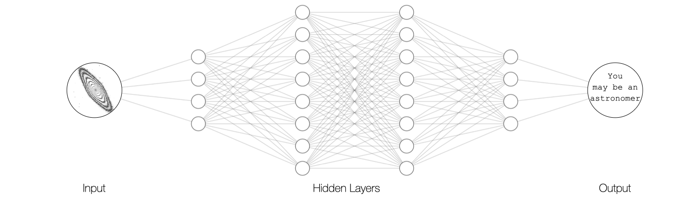

# About this blog

## An Astronomer's perspective on Deep Learning

This blog contains notes and notebooks of a researcher in Astrophysics diving deep into the
study of deep learning. What I found during my quest, and what I report here, is meant to be
purely anecdotical, and it is not necessarily following a logical educational path.
The hope with which I build this blog is that it will eventually become a useful reference for
me in the near future, and that maybe also other people may find some use out of my notes
and notebooks.

My name is [Lorenzo Posti](about.qmd) and I'm currently a research scientist at the
[Strasbourg Observatory](https://astro.unistra.fr/) (France) specialized in models of galaxy
dynamics, which I use to study the origin of galaxies and the nature of dark matter.
Find my list of publications at
[ADS](https://ui.adsabs.harvard.edu/search/q=docs(library%2FfCiUp3W_T7qXYNboezCKAg)&sort=date%20desc%2C%20bibcode%20desc&p_=0
)

This website is built using [Quarto](https://quarto.org/).
The diagram of the neural network in the banner was made using [NN-SVG](http://alexlenail.me/NN-SVG/index.html),
the input image shows isophotal contours of the galaxy NGC 4342 rendered from
[Hubble observations](https://archive.stsci.edu/missions-and-data/hst).
